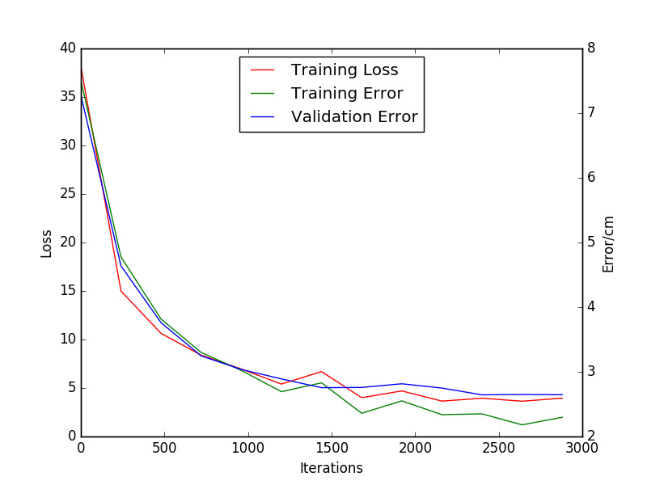

# DeepGaze
A TensorFlow model for selfie based eye gaze estimation.

## Model Architecture
The model implements a three-layer Convolutional Neural Network. Due to not having access to a GPU the model is designed with simplicity, without sacrificing accuracy, in mind. In order to reduce the computational load only the left eye pathway data is used. However, the model is still able to achieve rather impressive results given the limited and non-ideal nature of the data.

The model contains three convolution layers and two max pooling layers. Going from the first convolutional layer to the last one the filter size decreases and the number filters increases. The larger the filter size the less detail from the image is captured. Thus the first layer, having the largest filter, captures higher level features in the image. The subsequent convolutional layers capture more low level and detailed features. Furthermore, the number of filters increases because as the filter size is decreased more filters are needed to capture all the minute features. Pooling layers are used to reduce the dimension of the image to improve computation time. By keeping padding as “SAME” no part of the image is cut off and the dimensionality is retained. Although more computationally expensive it leads to better results in this case. The optimal filter sizes and number of filters was found by experimentation.

Lastly, it should be noted that all the weights are initialized using Tensorflows xavier_initializer_conv2d(uniform=False). Xavier initiation helps the error signal generated by the gradients reach deeper into the network by automatically determining the optimal scale of the weights based on the number of input and output neurons. It should be noted that the uniform parameter is intentionally set too False as this improves performance when using the ReLU activation function.

## Results
Using batch size of 200 the model is able to achieve a training error or 1.892 cm and a validation error of 2.59 cm. The model is trained for 12.5 epochs and took approximately 9 hours to train.

## Future Work
Since I don't have a GPU at the moment training takes a very long time. This severely limits my ability to run a more complex model. Once I get a GPU, which will be soon, I should be able to train a more complex model that uses all data pathways. This model should be able to achieve a much better validation accuracy.
